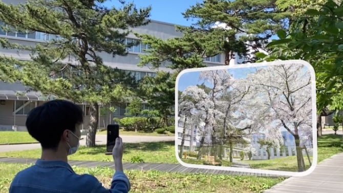
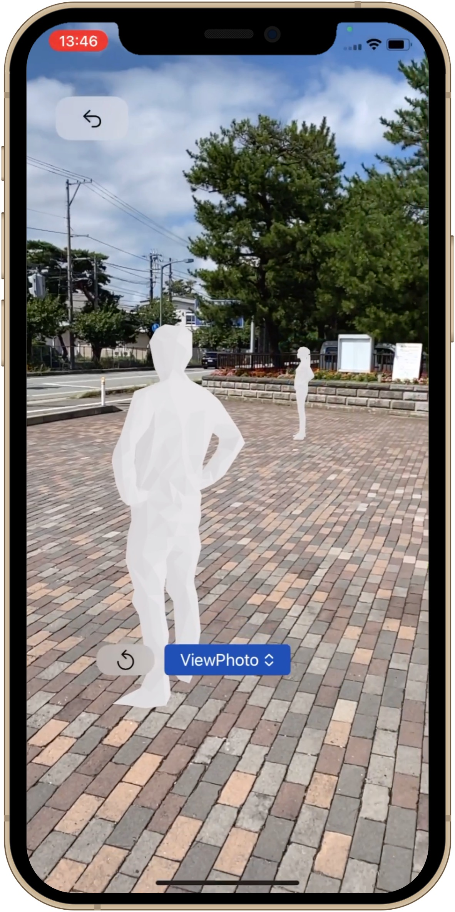

# What is ARTimeWalk

  

ARTimeWalk is an app that allows you to view past photographs at the exact locations where they were originally taken. By doing so, the photographs we commonly see on social media transform from static images into vivid memories, offering a tangible experience that transcends seasons and time.

For example, when you look at an ordinary photograph from everyday life, you might desire to relive that moment at the same location. ARTimeWalk utilizes advanced location-based technology to overlay past scenes and atmospheres onto the present reality. This creates an immersive experience, making it feel as though the moment captured in the photograph is unfolding right before your eyes.

The concept behind ARTimeWalk goes beyond mere photograph recreation. It aims to enhance the experience through digital technology while respecting the constraints of physical space and time. A photograph is not just a snapshot of a moment but encompasses the entire experience of visiting a place, feeling its events, and pressing the shutter button.

We hope that ARTimeWalk will offer a new perspective on how we perceive and interact with photographs.

 

ARTimeWalkは、過去の風景などを写した写真を現実世界の撮影場所で鑑賞するアプリケーションです。
私たちが日々SNSなどで見ている写真が、ただの静止画から生きた記憶となり、季節や時間を超えてリアルに体感できます。

例えば、何気ない日常の写真を見たとき、その瞬間を再びその場所で体験してみたくなることがあります。
ARTimeWalkは、高度な位置測位技術によって当時の風景や雰囲気を現実世界に重ね合わせることができます。
これにより、写真に収められた一瞬が、今まさに目の前に広がるような感覚を味わえます。

ARTimeWalkのコンセプトは、単なる写真の再現を超えて、物理的な場所や時間の制約を尊重しながらも、デジタル技術でその体験を豊かにすることです。
写真はそのときの一瞬を切り取るだけのものではありません。
ある場所に訪れ、その場所の出来事を目や身体で感じ、シャッターボタンを押すまでの一連の体験全てが写真です。

ARTimeWalkによって、写真に対する新たな視点が生まれることを願っています。

 

# Gallery

  
  
  

 

# Movie

  <iframe width="560" height="315" src="https://www.youtube.com/embed/0M_TU2QXXmk?si=qRCGXrpkaowZBmiP" title="YouTube video player" frameborder="0" allow="accelerometer; autoplay; clipboard-write; encrypted-media; gyroscope; picture-in-picture; web-share" referrerpolicy="strict-origin-when-cross-origin" allowfullscreen></iframe>

 

# VIO (Visual-Inertial Odometry)
The smartphone’s camera identifies markers such as signs or billboards in the city, which serve as 3D positional references. It measures the relative position and orientation of the marker and the camera with an accuracy of several tens of centimeters. Even if the smartphone is moved after recognizing the marker, its position and orientation remain highly accurate due to sensor fusion (VIO), which combines planar tracking by the camera with spatial positioning by a motion sensor that measures acceleration. ARTimeWalk is an application that leverages this cutting-edge technology.

 

スマートフォンのカメラは、都市の中で標識や看板などのマーカーを識別し、これらを三次元位置基準として利用します。マーカーとカメラの相対的な位置と向きを数十センチメートルの精度で計測します。マーカーを認識した後にスマートフォンが移動しても、位置と向きは高い精度で維持されます。これは、カメラによる空間トラッキングと、加速度を計測するモーションセンサーによる空間測位を統合したセンサーフュージョン（VIO）によるものです。ARTimeWalkは、この最先端技術を用いたアプリケーションです。

 

# App (iOS)

  

    
    
  

  
  

 

[Terms of Service](https://artimewalk.github.io/site/terms)

[Privacy Policy](https://artimewalk.github.io/site/privacy-policy)

 

  Created by: <a href="https://top.ie.akita-u.ac.jp/lab/" target="_blank">Arikawa Laboratory</a>

  Contact: ar-time-walk@si.akita-u.info

 

  

