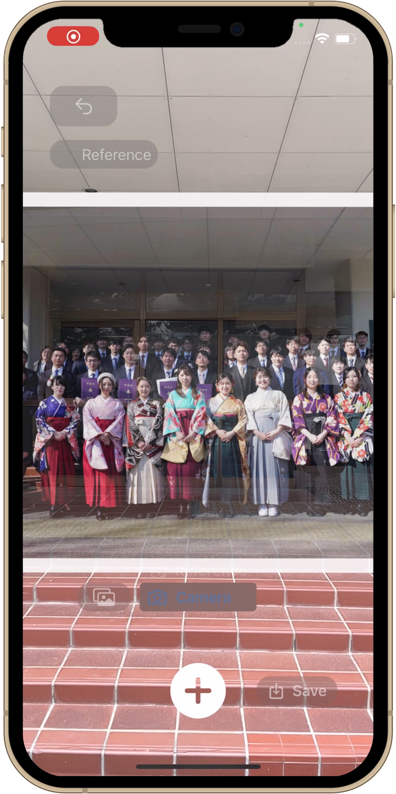
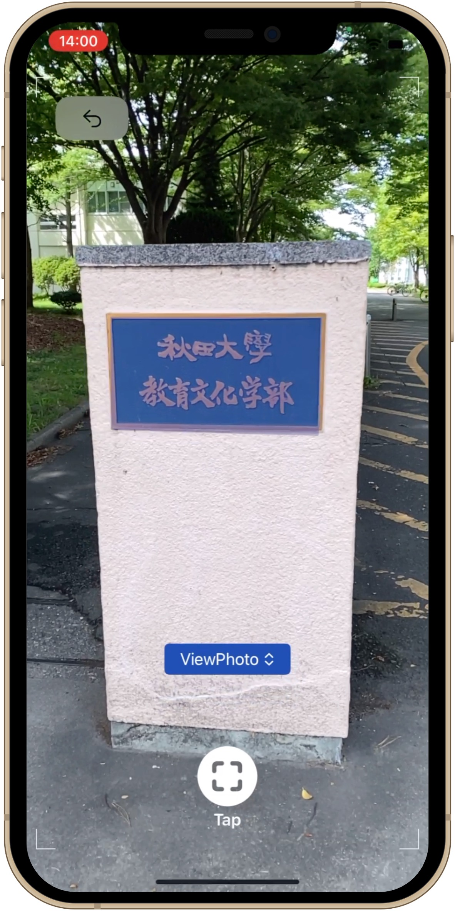
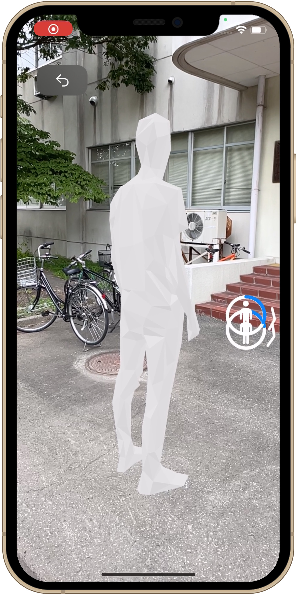

# What is ARTimeWalk
We propose a new style smartphone application that presents past photographs in AR (Augmented Reality) at the location in the real world where they were taken. The application consists of a process that provides precise location information of the photograph and a process that changes the present of the photograph depending on the user's movements. The new framework for easily registering photographs to the AR space using a smartphone realize a new innovative form of real world visual representation of photographs by adding physical actions. Additionally, the networked service will be introduced to the framework so that users could share rich experiences, for example, recording personal or historical stories and providing interesting content for tourist spots.

 

# App Screens

  
  
  

 

# Video

  <iframe width="560" height="315" src="https://www.youtube.com/embed/akJzsw4c75U" title="YouTube video player" frameborder="0" allow="accelerometer; autoplay; clipboard-write; encrypted-media; gyroscope; picture-in-picture; web-share" allowfullscreen></iframe>

 

# VIO (Visual-Inertial Odometry)
The smartphone's camera recognizes reference image markers (signs or billboards in the sity) that serve as 3D positional reference and measures the relative position and orientation of the marker and camera with an accuracy of several tens of centimeters. Even if the smartphone is moved after marker recognition, the position and orientation of the smartphone are maintained in high quality by sensor fusion (VIO) that integrates planar tracking by the camera and spatial positioning by a motion sensor that measures acceleration. AR Time Walk is an application that uses this state-of-the-art technology.
 
 

# Apple Store

  

    
    
  

  

 

  <a href="https://artimewalk.github.io/site/terms" target="_blank">Terms of Service</a>

  <a href="https://artimewalk.github.io/site/privacy-policy" target="_blank">Privacy Policy</a>

 

  Created by: <a href="https://top.ie.akita-u.ac.jp/lab/" target="_blank">Arikawa Laboratory</a>

  Contact: ar-time-walk@si.akita-u.info

 

  

