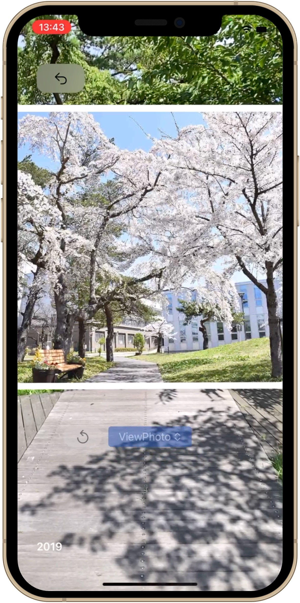

# What is ARTimeWalk
ARTimeWalk is an app that allows you to view past photographs at the exact locations where they were originally taken. By doing so, the photographs we commonly see on social media transform from static images into vivid memories, offering a tangible experience that transcends seasons and time.

For instance, when you look at an ordinary photograph from everyday life, you might feel a desire to relive that moment at the same location. ARTimeWalk enables you to overlay past scenes and atmospheres onto the present reality by incorporating these photographs. This creates an immersive experience, making it feel as though the captured moment is unfolding right before your eyes.

The concept behind ARTimeWalk goes beyond mere photograph recreation. It aims to enhance the experience through digital technology while respecting the constraints of physical space and time. A photograph is not just a snapshot of a moment but encompasses the entire experience of visiting a place, feeling its events, and pressing the shutter button.

We hope that ARTimeWalk will offer a new perspective on how we perceive and interact with photographs.

 

# App Screens

  
  
  

 

# Movie

  <iframe width="560" height="315" src="https://www.youtube.com/embed/0M_TU2QXXmk?si=qRCGXrpkaowZBmiP" title="YouTube video player" frameborder="0" allow="accelerometer; autoplay; clipboard-write; encrypted-media; gyroscope; picture-in-picture; web-share" referrerpolicy="strict-origin-when-cross-origin" allowfullscreen></iframe>

 

# VIO (Visual-Inertial Odometry)
The smartphone’s camera identifies markers such as signs or billboards in the city, which serve as 3D positional references. It measures the relative position and orientation of the marker and the camera with an accuracy of several tens of centimeters. Even if the smartphone is moved after recognizing the marker, its position and orientation remain highly accurate due to sensor fusion (VIO), which combines planar tracking by the camera with spatial positioning by a motion sensor that measures acceleration. ARTimeWalk is an application that leverages this cutting-edge technology.

 

# App (iOS)

  

    
    
  

  
  

 

[Terms of Service](https://artimewalk.github.io/site/terms)

[Privacy Policy](https://artimewalk.github.io/site/privacy-policy)

 

  Created by: <a href="https://top.ie.akita-u.ac.jp/lab/" target="_blank">Arikawa Laboratory</a>

  Contact: ar-time-walk@si.akita-u.info

 

  

